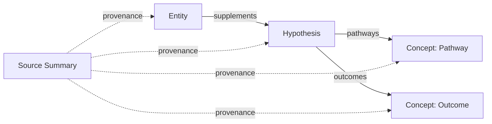

> [!tldr]
> The wiki's knowledge graph: node types, edge types, bidirectionality rules, and how frontmatter drives auto-generated views.

See also: [[ingest-checklist]], [[lint-rules]], [[research-methodology]], [[schema-canary]]

## Node Types

| Type | Directory | Represents | Key Frontmatter |
|------|-----------|------------|-----------------|
| entity | `wiki/entities/` | Supplements, compounds, brands, delivery forms | `entity_type`, `aliases`, `sources`, `evidence_level`, `mechanistic_evidence`, `animal_evidence`, `human_evidence`, `translational_status`, `practical_status`, `primary_outcomes`, `primary_pathways`, `primary_genetics` |
| concept | `wiki/concepts/` | Pathways, pathway families, outcomes, conditions, biomarkers, processes, risk domains, populations, genes, variants, genotypes | `concept_type`, `domain`, `sources` |
| hypothesis | `wiki/hypotheses/` | Testable claim: supplement → pathway/process → outcome/condition/risk-domain, optionally scoped by genetics | `supplements`, `pathways`, `outcomes`, `population`, `genetic_context`, `effect_direction`, `mechanistic_evidence`, `animal_evidence`, `human_evidence`, `translational_status`, `evidence_level`, `hypothesis_status`, `review_by`, `if_supported`, `if_contradicted`, `evaluated` |
| source-summary | `wiki/sources/` | One per ingested synthesis source or selected primary anchor | `raw_path`, `raw_hash`, `ingest_status`, `study_type`, `source_role`, `evidence_layer`, `reading_status`, `decision_relevance`, `anchor_for` |
| comparison | `wiki/comparisons/` | Head-to-head supplement comparison | `subjects` |
| stack | `wiki/stacks/` | Multi-supplement combination with rationale | `goal`, `supplements` |
| decision | `wiki/decisions/` | Practical supplement or stack decision with reversal criteria and outcome review | `decision_type`, `action`, `decision_status`, `supplements`, `related_stack`, `review_by`, `closed` |
| dosing | `wiki/dosing/` | Dedicated supplement dosing detail page | `supplement`, `aliases`, `sources` |
| query | `wiki/queries/` | Durable, reusable answers to practical or cross-page questions | `sources` |
| meta | `wiki/` root or scaffold files inside wiki subdirectories | Infrastructure, dashboards, generated catalogs, checklists, queues, READMEs, and process docs | `sources`, `tags` |

## The Core Chain

The primary directed path through the graph:

Hypothesis pages are the central structural element. Each hypothesis's frontmatter lists supplements (entities), pathways or processes (concepts with `concept_type: pathway`, `pathway-family`, or `process`), outcomes or conditions (concepts with `concept_type: outcome`, `condition`, or `risk-domain`), population scope, optional genetic context, evidence-stream ratings, and effect direction. This creates the directed path **Entity → Mechanism/Process → Outcome/Condition**, mediated by the hypothesis.

Without a hypothesis page, the entity-to-concept connection is implicit (via tags and body text). With one, it is explicit and queryable by DataView.

## Edge Types

### Provenance (content → source)

Every content page links to its source-summary pages. Two mechanisms:
- `sources: []` frontmatter — list of wikilinks to source-summary pages
- source-summary wikilinks inside every `[!source]` callout

This is the "why do we believe this" edge.

Research reports are valid synthesis sources. Promote individual primary sources into their own source-summary pages only when they anchor a major RCT/meta-analysis, dosing claim, safety claim, contradiction, genetics claim, or stack decision. This keeps the graph usable while preserving provenance for high-impact claims.

`source_role` and `evidence_layer` are separate graph dimensions. `source_role` explains why the source is in the graph; `evidence_layer` preserves whether the claim is mechanistic, animal, human, genetics, or mixed evidence. A high-quality source does not upgrade mechanistic evidence into human evidence.

Decision-critical claims should point to at least one non-synthesis anchor source. Report-derived claims waiting for anchor review belong in [[promotion-queue]].

### Reverse Provenance (source → content)

Source-summary pages link forward to the content they produced:
- "Entities Mentioned" section — wikilinks to entity pages created/updated from this source
- "Concepts Covered" section — wikilinks to concept pages created/updated from this source
- "Hypotheses or Decisions Anchored" section — wikilinks to hypothesis, comparison, stack, dosing, or decision pages this source supports
- "Claims Anchored" table — the specific claim, evidence layer, stream rating, and evidence level supported by this source

This enables tracing forward: "what pages did this source produce?"

### Hypothesis Chain

The only edge type that creates explicit directed paths between entity and concept nodes:
- Frontmatter: `supplements`, `pathways`, and `outcomes` fields hold wikilinks to entity and concept pages
- Body "Chain" section restates these as visible wikilinks

### Lateral

- **Entity ↔ Entity**: "Interactions" section links to other entities (supplement-supplement, supplement-drug)
- **Concept → Entity**: "Evidence Map" table links back to entities
- **Concept → Concept**: "Connections" section links related pathways/outcomes
- **Concept → Hypothesis**: "Related Hypotheses" section links hypothesis pages
- **Comparison → Entity**: `subjects: []` frontmatter + table column headers
- **Stack → Entity**: `supplements: []` frontmatter + composition table rows
- **Decision → Entity/Stack**: `supplements: []` and optional `related_stack` frontmatter + supporting evidence links

### Tag Shadow Graph

Tags create implicit groupings independent of wikilinks. Use them for semantic navigation only; do not mirror frontmatter fields such as evidence level, evidence stream, translational status, or practical status.

| Tag Pattern | Groups By | Used In |
|-------------|-----------|---------|
| `supplement/<name>` | Supplement identity | interactions.md, taxonomy.md |
| `pathway/<name>` | Pathway membership | taxonomy.md, cross-cutting queries |
| `outcome/<name>` | Outcome membership | taxonomy.md, cross-cutting queries |
| `condition/<name>` | Disease or symptom domain | condition/outcome dashboards |
| `process/<name>` | Basic biology process | mechanism and basic-biology queries |
| `risk-domain/<name>` | Disease-risk framing | prevention and risk-reduction queries |
| `population/<name>` | Population boundary condition | subgroup and generalizability queries |
| `gene/<name>` | Gene-level context | genetics and pharmacogenomics queries |
| `variant/<name>` | Variant/SNP context | genetics and pharmacogenomics queries |
| `genotype/<name>` | Genotype or carrier-state context | genetics and pharmacogenomics queries |
| `open-question` | Unresolved gaps | index.md, research-backlog.md |

## Bidirectionality Rules

1. **No orphans.** Every content page must have at least one incoming wikilink. The lint pass checks this. `type: query` pages are the exception because they are reached through [[queries/README]], DataView, and [[catalog]] rather than reciprocal content links.
2. **No dead ends.** Every content page must have at least one outgoing wikilink. The lint pass checks this.
3. **Meta links do not prove graph connectivity.** Infrastructure pages such as [[catalog]], [[index]], [[handoff]], and directory READMEs may link widely for navigation, but those links do not satisfy content-page orphan checks.
4. **Provenance is bidirectional.** If a content page cites a source, the source-summary must list the content page under "Entities Mentioned," "Concepts Covered," "Hypotheses or Decisions Anchored," or "Claims Anchored."
5. **Hypothesis edges are reciprocated.** If a hypothesis links an entity, the entity page should reference the hypothesis in its "Relationships" section.

## DataView Dependencies

This table shows which scaffold pages break if frontmatter is wrong.

| Scaffold Page | Selects On | Reads Frontmatter |
|---------------|-----------|-------------------|
| [[index]] | directory, type | `entity_type`, `concept_type`, `hypothesis_status`, `review_by`, `evidence_level`, `sources`, `subjects`, `goal`, `supplements`, `decision_type`, `action`, `decision_status` |
| [[catalog]] | page frontmatter and TLDRs via `wiki/scripts/lint.py --rebuild-catalog` | `type`, `entity_type`, `concept_type`, `hypothesis_status`, `review_by`, `evidence_level`, `sources`, `subjects`, `goal`, `supplements`, `decision_type`, `action`, `decision_status`, `source_role`, `evidence_layer`, `reading_status` |
| [[research-backlog]] | tags, hypothesis_status | `tags` (open-question), `hypothesis_status`, `review_by`, `sources` (length), `updated` |
| [[debates]] | hypothesis_status | `hypothesis_status` (nuanced, contradicted) |
| [[interactions]] | entity_type | `entity_type` (supplement), `file.outlinks` |
| [[taxonomy]] | tags | `tags` (pathway/\*, outcome/\*, condition/\*, process/\*, risk-domain/\*, population/\*) |
| [[Quick Reference Dosing]] | entity_type, dosing type | `entity_type` (supplement), `type: dosing`, `supplement`, `updated` |
| [[Evidence Map]] | entity, concept, hypothesis metadata | `practical_status`, `evidence_level`, `mechanistic_evidence`, `animal_evidence`, `human_evidence`, `translational_status`, `effect_direction`, `population`, `genetic_context`, `primary_outcomes`, `primary_pathways`, `primary_genetics`, `concept_type`, `domain` |
| [[research-queue]] | Markdown table rows, maintained by `wiki/scripts/backlog_sync.py` | ID, Source Page, Review By, Priority, Status |
| [[evidence-watch]] | Markdown table rows, linted by `wiki/scripts/lint.py` | Date, Event, Target, Hypothesis / Decision, Status |
| Directory READMEs | directory, type | `entity_type`, `concept_type`, `hypothesis_status`, `review_by`, `evidence_level`, `sources`, `subjects`, `goal`, `supplements`, `supplement`, `study_type`, `source_role`, `evidence_layer`, `raw_path` |

## Template Usage

| Template | When to Create | Structural Sections (must follow pattern) | Content Sections (flexible) |
|----------|---------------|------------------------------------------|----------------------------|
| entity | One per supplement or compound | Decision Snapshot, Relationships, Interactions, Evidence table format, Dosing table format | What It Is, Mechanism of Action, Safety Profile, Practical Notes, Key Gaps |
| concept | One per pathway, pathway family, outcome, condition, biomarker, process, risk domain, population, gene, genetic variant, genotype, or pharmacogenomic marker | Evidence Map, Related Hypotheses, Connections | Definition, Relevance to Longevity, Key Claims, Contradictions & Tensions, Open Questions |
| hypothesis | When a claim spans supplements, genetics, or carries tension | Chain, Status, Review Plan, Evidence Stream Summary, frontmatter (`supplements`, `pathways`, `outcomes`, `review_by`) | Claim, Supporting/Contradicting Evidence, Tensions and Nuances, What Would Change This |
| source-summary | One per ingested synthesis source or selected primary anchor | Entities Mentioned, Concepts Covered, Hypotheses or Decisions Anchored, frontmatter (`raw_path`, `raw_hash`, `ingest_status`, `source_role`, `evidence_layer`) | Key Takeaways, Evidence Assessment, Claims Anchored, Promotion Notes |
| comparison | When two supplements compete for the same role | subjects frontmatter, Comparison table format | Analysis, Interaction Considerations, Recommendation, Open Questions |
| stack | When designing a multi-supplement regimen | supplements frontmatter, Composition table, Interaction Check | Goal, Rationale, Evidence Assessment, Open Questions |
| decision | When a supplement or stack action needs durable reasoning and later outcome review | decision frontmatter, What, What Would Change My Mind, Follow-Up, Outcome | Why, Supporting Evidence |
| dosing | When an entity page's dosing section grows too large or varies by form/outcome | supplement frontmatter, Forms Comparison, Dosing by Outcome | Timing and Cycling, Special Populations, Decision Notes, Key Gaps |
| query | When a question is likely to recur or the answer synthesizes multiple pages | sources frontmatter, clear answer section, cited source summaries | Evidence summary, Practical implications, Gaps, Related pages |

## Ingest Sequence

The order pages are created during an ingest. The graph builds up incrementally:

1. **Source-summary** — created first for the report or raw source with `ingest_status: in-progress` (`source_role: synthesis` for AI reports)
2. **Anchor scan** — identify decision-critical claims and either promote anchor sources or add them to [[promotion-queue]]
3. **Entity pages** — created/updated for each supplement mentioned in the source
4. **Concept pages** — created/updated for pathways, pathway families, outcomes, conditions, biomarkers, processes, risk domains, populations, genes, variants, genotypes, or pharmacogenomic markers discovered
5. **Hypothesis pages** — created for significant cross-cutting claims (not every claim needs one)
6. **Comparison/stack/decision pages** — created if the source enables a comparison, stack, or practical supplement decision
7. **Scaffold updates** — synthesis, interactions, debates, structural decisions log, research queue, evidence watch, operation log, handoff, catalog, taxonomy, Quick Reference Dosing
8. **Bidirectionality and provenance check** — verify all new pages have incoming and outgoing links, all `[!source]` callouts cite a source-summary, decision-critical claims cite a non-synthesis anchor or are marked unverified/gap, all source-summaries list their derived pages, and the source-summary is flipped to `ingest_status: complete`
